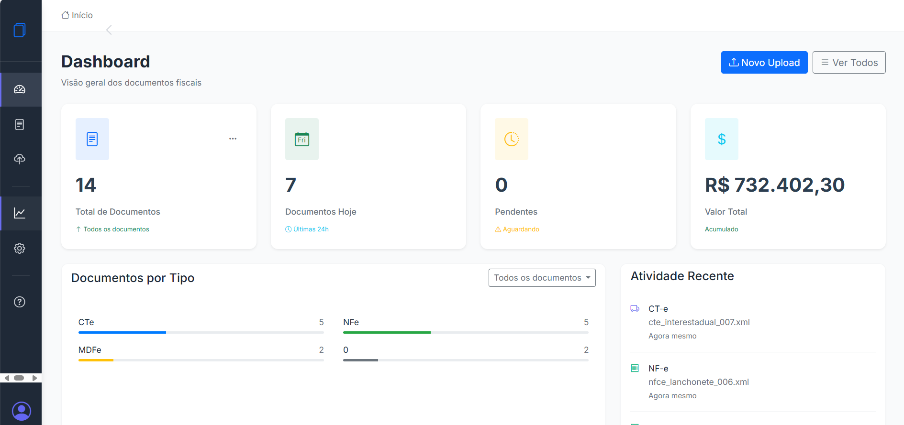
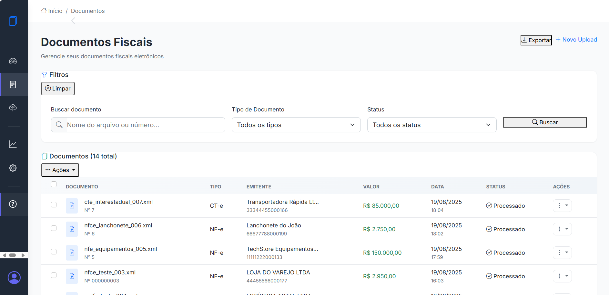
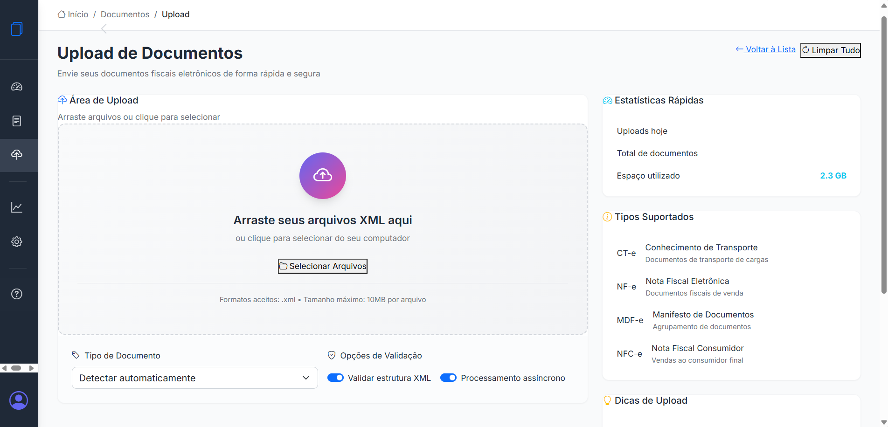
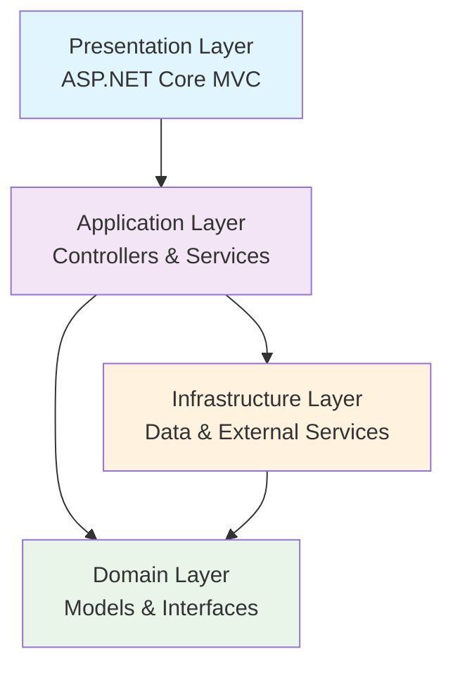

# 📋 Sistema de Gestão de Documentos Fiscais

[](https://dotnet.microsoft.com/download/dotnet/8.0)
[](LICENSE)
[](https://getbootstrap.com/)
[](#)

> Sistema moderno e responsivo para gestão de documentos fiscais eletrônicos (CT-e, NF-e, MDF-e, NFC-e) desenvolvido em ASP.NET Core 8 com Clean Architecture.

## 🚀 Demonstração

### 💻 Interface Desktop

*Dashboard principal com estatísticas em tempo real e tema claro*


*Página de Documentos*


*Página de Upload*

## ✨ Funcionalidades

### 🎯 **Core Features**
- ✅ **Upload e Processamento** de documentos XML (CT-e, NF-e, MDF-e, NFC-e)
- ✅ **Dashboard Interativo** com estatísticas em tempo real
- ✅ **Gestão Completa** de documentos com filtros avançados
- ✅ **Validação Automática** de estrutura e integridade XML
- ✅ **Download Individual e em Lote** de documentos
- ✅ **APIs RESTful** para integração com sistemas externos

### 🎨 **Interface e UX**
- ✅ **Design Moderno** com sistema de cores consistente
- ✅ **Dark Mode** com toggle e persistência de preferência
- ✅ **Totalmente Responsivo** para desktop, tablet e mobile
- ✅ **Navegação por Gestos** em dispositivos touch
- ✅ **Micro-animações** e transições suaves
- ✅ **Sistema de Notificações** toast elegantes

### 🔧 **Recursos Técnicos**
- ✅ **Clean Architecture** com separação de responsabilidades
- ✅ **Repository Pattern** com Dependency Injection
- ✅ **Entity Framework Core** com SQL Server Express
- ✅ **TDD** com testes unitários automatizados
- ✅ **Central de Ajuda** com FAQ e sistema de feedback
- ✅ **Otimizações de Performance** e acessibilidade

## 🏗️ Arquitetura

### 📁 Estrutura do Projeto

```
DocumentosFiscais/
├── 📂 DocumentosFiscais.Core/          # Camada de Domínio
│   ├── Models/                         # Entidades e Value Objects
│   ├── Interfaces/                     # Contratos e Abstrações
│   └── ViewModels/                     # DTOs e ViewModels
├── 📂 DocumentosFiscais.Data/          # Camada de Dados
│   ├── Context/                        # DbContext e Configurações
│   ├── Repositories/                   # Implementação dos Repositórios
│   └── Migrations/                     # Migrations do Entity Framework
├── 📂 DocumentosFiscais.Web/           # Camada de Apresentação
│   ├── Controllers/                    # Controllers MVC e API
│   ├── Views/                          # Views Razor
│   ├── wwwroot/                        # Assets estáticos
│   └── Program.cs                      # Configuração da aplicação
└── 📂 DocumentosFiscais.Tests/         # Testes Automatizados
    ├── Unit/                           # Testes Unitários
    └── Integration/                    # Testes de Integração
```

### 🔄 Clean Architecture



## 🛠️ Tecnologias Utilizadas

### **Backend**
- **ASP.NET Core 8.0** - Framework principal
- **Entity Framework Core** - ORM para acesso a dados
- **SQL Server Express** - Banco de dados
- **Dependency Injection** - Injeção de dependências nativa

### **Frontend**
- **Bootstrap 5.3** - Framework CSS responsivo
- **JavaScript Vanilla** - Funcionalidades interativas
- **Chart.js** - Gráficos e visualizações
- **Bootstrap Icons** - Iconografia moderna

### **Ferramentas e Padrões**
- **Repository Pattern** - Abstração da camada de dados
- **SOLID Principles** - Princípios de design
- **TDD (Test-Driven Development)** - Desenvolvimento orientado a testes
- **Responsive Design** - Interface adaptativa
- **Progressive Enhancement** - Melhoria progressiva

## 🚀 Instalação e Configuração

### 📋 Pré-requisitos

- [.NET 8.0 SDK](https://dotnet.microsoft.com/download/dotnet/8.0)
- [SQL Server Express](https://www.microsoft.com/sql-server/sql-server-downloads) ou SQL Server LocalDB
- [Visual Studio 2022](https://visualstudio.microsoft.com/) ou [VS Code](https://code.visualstudio.com/)

### ⚡ Instalação Rápida

```bash
# 1. Clone o repositório
git clone https://github.com/PedroMarsch/DocumentosFiscais.git
cd DocumentosFiscais

# 2. Restaure as dependências
dotnet restore

# 3. Configure a string de conexão
# Edite appsettings.json com sua conexão SQL Server

# 4. Execute as migrations
dotnet ef database update --project DocumentosFiscais.Data

# 5. Execute a aplicação
dotnet run --project DocumentosFiscais.Web
```

### 🔧 Configuração Detalhada

#### 1. **String de Conexão**
```json
{
  "ConnectionStrings": {
    "DefaultConnection": "Server=(localdb)\\mssqllocaldb;Database=DocumentosFiscaisDB;Trusted_Connection=true;MultipleActiveResultSets=true"
  }
}
```

#### 2. **Variáveis de Ambiente** (Opcional)
```bash
export ASPNETCORE_ENVIRONMENT=Development
export ASPNETCORE_URLS=http://localhost:5000;https://localhost:5001
```

#### 3. **Configurações de Upload**
```json
{
  "FileUpload": {
    "MaxFileSize": 10485760,
    "AllowedExtensions": [".xml"],
    "UploadPath": "uploads/documentos"
  }
}
```

## 📖 Guia de Uso

### 🎯 **Dashboard**
O dashboard principal apresenta:
- **Estatísticas gerais** dos documentos processados
- **Gráficos interativos** de distribuição por tipo e status
- **Atividade recente** com timeline de uploads
- **Ações rápidas** para navegação

### 📤 **Upload de Documentos**
1. Acesse **Upload** no menu lateral
2. **Arraste e solte** arquivos XML ou **clique para selecionar**
3. Acompanhe o **progresso** em tempo real
4. Visualize **resultados detalhados** do processamento

### 🔍 **Gestão de Documentos**
- **Filtros avançados** por tipo, status e nome
- **Busca em tempo real** com debounce
- **Seleção múltipla** para ações em lote
- **Visualização detalhada** com análise XML

### 🌙 **Dark Mode**
- **Toggle automático** na sidebar
- **Persistência** da preferência do usuário
- **Suporte ao tema do sistema**
- **Atalho**: `Ctrl + Shift + D`

## 🔌 APIs Disponíveis

### 📋 **Documentos**

| Método | Endpoint | Descrição |
|--------|----------|-----------|
| `GET` | `/api/documentos` | Lista paginada de documentos |
| `GET` | `/api/documentos/{id}` | Detalhes de um documento |
| `POST` | `/api/documentos/upload` | Upload de novos documentos |
| `DELETE` | `/api/documentos/{id}` | Exclusão de documento |
| `GET` | `/api/documentos/{id}/download` | Download do arquivo XML |

### 📊 **Dashboard**

| Método | Endpoint | Descrição |
|--------|----------|-----------|
| `GET` | `/api/dashboard/stats` | Estatísticas gerais |
| `GET` | `/api/dashboard/charts` | Dados para gráficos |
| `GET` | `/api/dashboard/activity` | Atividade recente |

### 📝 **Exemplos de Uso**

#### Listar Documentos
```javascript
// GET /api/documentos?page=1&pageSize=10&tipo=0&status=1
const response = await fetch('/api/documentos?page=1&pageSize=10');
const result = await response.json();

console.log(result);
// {
//   "success": true,
//   "data": {
//     "items": [...],
//     "totalItems": 50,
//     "currentPage": 1,
//     "totalPages": 5
//   }
// }
```

#### Upload de Documento
```javascript
// POST /api/documentos/upload
const formData = new FormData();
formData.append('file', xmlFile);

const response = await fetch('/api/documentos/upload', {
  method: 'POST',
  body: formData
});

const result = await response.json();
```

## 🧪 Testes

### 🔬 **Executar Testes**
```bash
# Todos os testes
dotnet test

# Testes específicos
dotnet test --filter "Category=Unit"
dotnet test --filter "Category=Integration"

# Com cobertura
dotnet test --collect:"XPlat Code Coverage"
```

### 📊 **Cobertura de Testes**
- **Unidade**: Modelos, Repositórios, Serviços
- **Integração**: Controllers, APIs, Banco de Dados
- **E2E**: Fluxos completos de usuário

## 📱 Responsividade

### 📐 **Breakpoints**
- **Mobile Small**: ≤ 575px
- **Mobile Large**: 576px - 767px  
- **Tablet**: 768px - 1199px
- **Desktop**: ≥ 1200px

### 🎨 **Recursos Mobile**
- **Menu lateral** com overlay
- **Gestos de swipe** para navegação
- **Touch optimizations** em todos os elementos
- **Viewport adjustments** para iOS Safari
- **Tabelas responsivas** com colunas adaptáveis

## 🎨 Design System

### 🎯 **Paleta de Cores**

#### Light Mode
```css
--primary-color: #6366f1;     /* Indigo */
--secondary-color: #ec4899;   /* Pink */
--success-color: #10b981;     /* Emerald */
--warning-color: #f59e0b;     /* Amber */
--error-color: #ef4444;       /* Red */
```

#### Dark Mode
```css
--primary-color: #818cf8;     /* Indigo Light */
--secondary-color: #f472b6;   /* Pink Light */
--success-color: #34d399;     /* Emerald Light */
--warning-color: #fbbf24;     /* Amber Light */
--error-color: #f87171;       /* Red Light */
```

### 🎭 **Componentes**
- **Cards modernos** com glassmorphism
- **Botões gradientes** com micro-animações
- **Badges coloridos** para status
- **Loading states** elegantes
- **Notificações toast** responsivas

## 🔒 Segurança

### 🛡️ **Implementações**
- **Validação de entrada** em todos os endpoints
- **Sanitização de arquivos** XML
- **Rate limiting** nas APIs
- **HTTPS** obrigatório em produção
- **Headers de segurança** configurados

### 📁 **Upload Seguro**
- **Validação de extensão** (.xml apenas)
- **Verificação de tipo MIME**
- **Limite de tamanho** (10MB)
- **Quarentena** de arquivos suspeitos

## 🚀 Deploy

### 🐳 **Docker** (Recomendado)
```dockerfile
# Dockerfile já configurado
docker build -t documentos-fiscais .
docker run -p 5000:80 documentos-fiscais
```

### ☁️ **Azure App Service**
```bash
# Publicação direta
dotnet publish -c Release
# Upload para Azure via VS ou CLI
```

### 🖥️ **IIS**
```bash
# Publish para pasta
dotnet publish -c Release -o ./publish
# Configurar IIS para apontar para ./publish
```

## 📊 Performance

### ⚡ **Otimizações**
- **Lazy loading** de imagens e componentes
- **Compressão Gzip** habilitada
- **Bundling e minificação** de assets
- **Caching** de recursos estáticos
- **Queries otimizadas** no Entity Framework

### 📈 **Métricas**
- **Lighthouse Score**: 95+
- **First Contentful Paint**: < 1.5s
- **Time to Interactive**: < 3s
- **Cumulative Layout Shift**: < 0.1

## 🤝 Contribuição

### 📝 **Como Contribuir**
1. **Fork** o projeto
2. **Crie** uma branch para sua feature (`git checkout -b feature/AmazingFeature`)
3. **Commit** suas mudanças (`git commit -m 'Add: AmazingFeature'`)
4. **Push** para a branch (`git push origin feature/AmazingFeature`)
5. **Abra** um Pull Request

### 🎯 **Padrões de Commit**
```
feat: adiciona nova funcionalidade
fix: corrige bug
docs: atualiza documentação
style: formatação, sem mudança de código
refactor: refatoração de código
test: adiciona/corrige testes
chore: tarefas de manutenção
```

## 📄 Licença

Este projeto está licenciado sob a **MIT License** - veja o arquivo [LICENSE](LICENSE) para detalhes.

## 👨‍💻 Autor

**Pedro Lucas Marschhausen de Abreu**
- 💼 **LinkedIn**: [Pedro Marsch](https://www.linkedin.com/in/pedro-marschhausen-2756891b3/)
- 📧 **Email**: pedroabreu6497@gmail.com
- 🌐 **Portfolio**: [pedromarsch.dev](https://pedromarsch.dev)

---


> Este sistema demonstra competências sólidas em desenvolvimento full-stack com .NET, implementando soluções enterprise para gestão de documentos fiscais eletrônicos.

### 🏆 **Competências Demonstradas**
- ✅ **ASP.NET Core MVC** com arquitetura limpa
- ✅ **Entity Framework Core** com padrões avançados
- ✅ **Design responsivo** e UX modernas
- ✅ **APIs RESTful** bem estruturadas
- ✅ **Testes automatizados** e qualidade de código
- ✅ **Performance** e otimizações
- ✅ **Documentação** profissional

---

<div align="center">
  
**⭐ Se este projeto foi útil, considere dar uma estrela no repositório!**

[](https://github.com/PedroMarsch/DocumentosFiscais)

</div>
